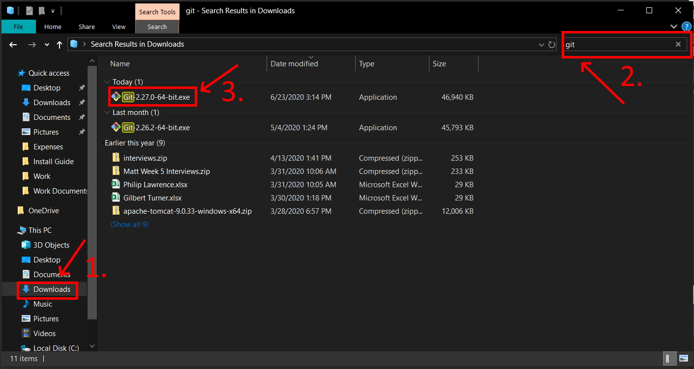
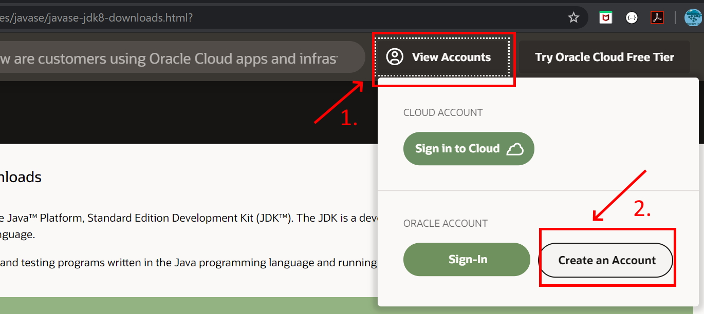
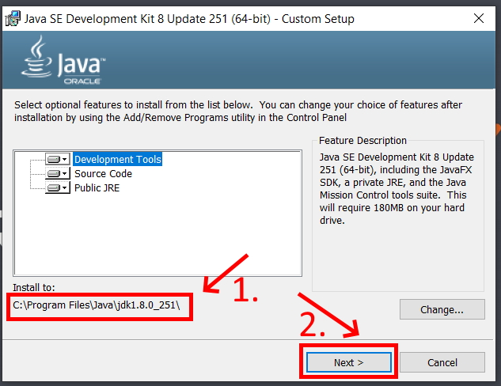
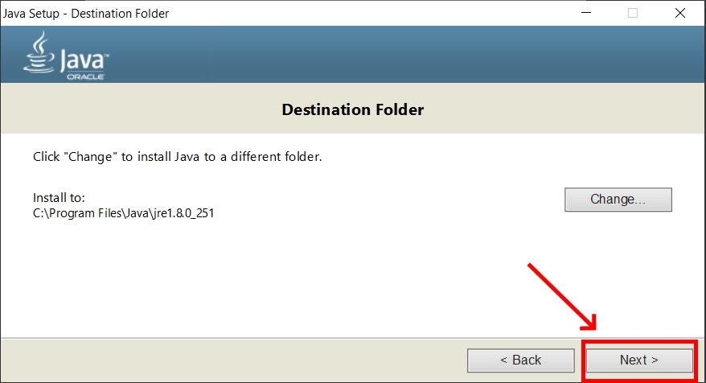
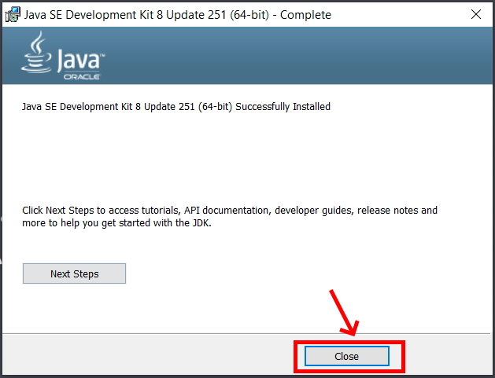
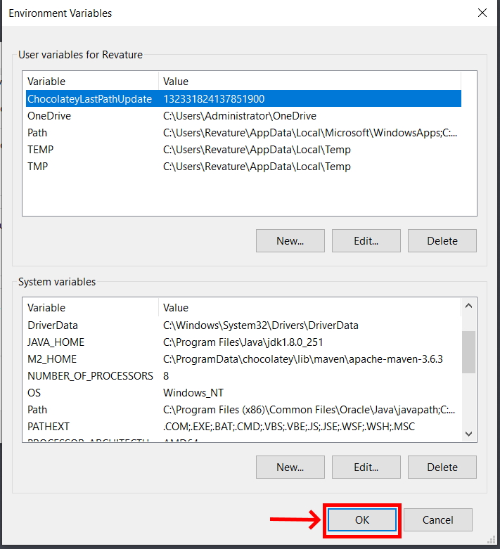
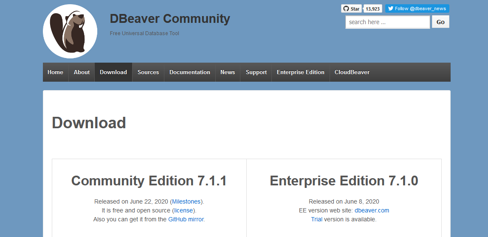
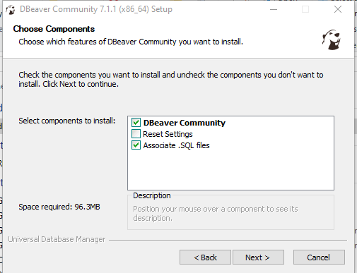
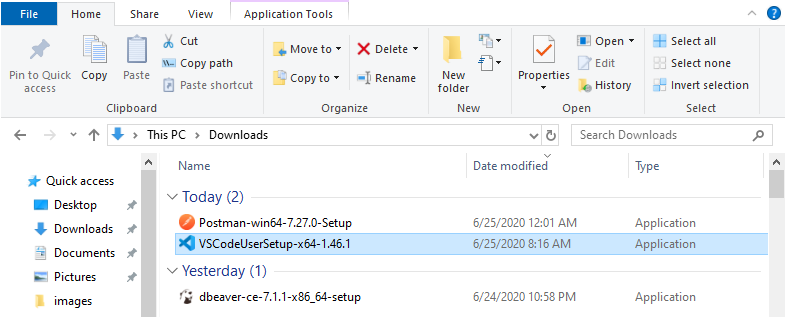

# Java Full Stack Environment Setup Guide
---

## Purpose

> This document provides a list of the required technologies for associates in Revature's Java Full Stack batch. It details why each technology is required and provides some step-by-step instructions on how to install and configure the technologies. This guide also walks you through any needed environment setup.

**NOTE**: It is VERY important that you install these technologies before training begins as we will not have much time to devote to environment setup due to the volume of content we'll cover. It is also important that you install the correct versions of the tools listed here when they are specified (as opposed the latest versions) as not all versions of the technologies we will use are guaranteed to be compatible with each other. If you choose to use a different version of one of the tools listed here, you will be responsible for debugging issues that are specific to your version.

## Required Technologies

The following technologies are required in order to complete this phase of the program:

- **Git**: We'll be using Git as a version control tool during the course of this program. Not only will you use Git to track changes to your projects, but you'll also use it to collaborate with your trainer and with your fellow associates.
- **Java SE Development Kit 8**: We will be utilizing Java 8 as our primary language for the duration of the program. This software development kit will provide the compiler and runtime environment needed to quickly and efficiently develop Java applications.
- **IntelliJ Community Edition**: We will be using IntelliJ as our *integrated development environment* (IDE). Though you don't need an IDE to write code, an IDE provides several features that make rapid development (e.g. quickly writing and refactoring code) easier.IntelliJ also has a premium version that requires a subscription that we will not be using. 
- **Gradle**: Gradle is a software project management and build automation tool. We will use it to manage our projects' builds as it provides dependency management and streamlines several aspects of the testing life cycle.
- **DBeaver**: DBeaver is a free, open source universal database tool that is compatible with several external data sources. We'll use DBeaver in order to modify our databases (which will be hosted on AWS) and persist data using a simple user interface provided to us by the tool.
- **Visual Studio Code**: Visual Studio Code is a text editor that makes viewing and modifying code simple. Do not confuse this tool with an integrated development environment as it does not come equipped with all of the development tools you typically find in an IDE. We will be leveraging this tool for much of our front-end development. 
- **Postman**: Postman is used for testing RESTful APIs. We'll use it to set up collections of tests for the RESTful APIs we design throughout the program. It can also be used to quickly test a single endpoint.

## Installation Methods

There are two provided methods of attaining and configuring all of the necessary tools listed above:

1. Via a *package manager* or command-line installer
2. Manually downloading the necessary software

Neither method is more "correct" than the other. You should choose the method of attaining the tools that works best for you. You may even choose to mix both methods, downloading some tools manually and others via a package manager.

## Method 1: Installation Guide Using A Package Manager

A *package manager* is a command line tool that allows you to install and manage software. You can use a package manager to install most of the software listed here.

The package manager that we'll be using for this guide is called "Scoop". It's a command-line installer for Windows, which means that you'll have to be running Windows in order to use this tool. You'll also need PowerShell 5 (or a later version) installed.

**Note**: If you are not running Windows and still want to use a package manager, feel free to do so. You'll have to, however, know how to use your package manager of choice as there won't be instructions provided here since there are many package managers available. **If you do not wish to use a package manager, please skip to method 2.**

### Step 1: Install Scoop

In order to use Scoop, you'll first have to install it. This installation requires that you have PowerShell 5 or later.

Once you've verified that you have a compatible version of PowerShell, launch PowerShell. You can launch PowerShell by searching for it in the Windows search bar. Then go to [Scoop's official website](https://scoop.sh/). Once on the homepage, scroll to the bottom of the page until you see the following:

As Scoop's installation instructions indicate, you can run one of the following commands in PowerShell (NOT both):

Option 1:

    Invoke-Expression (New-Object System.Net.WebClient).DownloadString('https://get.scoop.sh')

Option 2:

    iwr -useb get.scoop.sh | iex

If you run one of these commands and it fails, you'll need to first run the following command:

    Set-ExecutionPolicy RemoteSigned -scope CurrentUser

After you've run this command, you should then attempt to run one of the first two commands again.

### Step 2: Configure Scoop

When installed, Scoop comes with a default bucket titled "main". Since some of the programs we'll install using Scoop aren't contained in this bucket, we'll add some additional buckets before we begin installing our programs.

Open a new terminal and run the following commands (one by one):

    scoop bucket add extras
    scoop bucket add java
    scoop bucket add versions

**Note**: If you receive a warning that says that the bucket you're attempting to add already exists, you don't have to worry as this means that you already have that bucket.

### Step 3: Install Java

Now that you've installed Scoop and added some additional buckets for downloading software, open a new terminal and run the following command in order to install Java:

    scoop install ojdkbuild8-full

Now verify that you have installed Java properly by typing this command:

     java -version

### Step 4: Install IntelliJ Community Edition

See this [this install guide](https://treehouse.github.io/installation-guides/windows/intellij-idea-win.html) to manually install IntelliJ. 

### Step 5: Install Gradle

In order to install Gradle, run the following command in your terminal:

    scoop install gradle

Verify that your Gradle installation was successful by typing the following command into the terminal. (Note that may have to close the terminal and open a new one for it to work.):

    gradle -v

### Step 6: Install DBeaver

In order to install DBeaver, run the following command in your terminal:

    scoop install dbeaver

You can verify that you have installed DBeaver properly by searching for "DBeaver" in your Windows search bar.

### Step 7: Install Postman

In order to install Postman, run the following command in your terminal:

    scoop install postman

Verify that the program was installed properly by searching for "Postman" in your windows search bar.

### Step 8: Install Visual Studio Code

In order to install Visual Studio Code, run the following command in your terminal:

    scoop install vscode

If the installation was successful, you should be able to search for "Visual Studio Code" in the Windows search bar.

### Step 9: Install Git
While scoop can install Git we HIGHLY recommend a manual install as it allows you to also install some ease-of-life optional features. 

1. Navigate in your browser to [Git's Website](https://git-scm.com/download) and click the latest download for Windows. (For those using a different OS click the appropriate OS and look for the most recent stable release.)

 

2. Click yes to any security/firewall popup asking if you are sure you want to download the file. 

3. The install file will begin downloading; most browsers will show the file that has just downloaded, click that file when it completes. If you do so skip to step 6. If the download is not apparent on your browser or disappears upon finishing go to step 4. 

4. If you were not able to click the install exe file you just downloaded in your browser open your file explorer.

5. In the window that opens click the "Downloads" folder, use the search bar in the upper right to search "git", and then double click on the Git installer exe file.

6. Click yes to any security pop-ups asking you if you want to allow the installer to make changes to your computer. 

7. The install wizard will open to guide you through the process of installing Git. Read the license agreement and click "Next." 

8. Accept the default installation path by clicking "Next."

9. Select your components. It is recommended to add a desktop icon. Leave the other boxes in their default setting. Click "Next."

10. Leave the rest of the set up as the default configuration clicking Next until you get to the experimental options (which you should leave unchecked) and then click Install. This will run the actual install process. 

11. After install you will get a a final window giving you the options to launch Git Bash and view the Readme notes. Select open Git Bash and deselect the view Readme notes. Click "Next."

12. When Git Bash opens type "git --version" and hit Enter. If it return the version of Git you installed it correctly. 

## Method 2: Manual Installation

This method is compatible with all environments as it does not require any platform-specific package managers. You need only visit the official websites for each of the technologies listed and download the version of the tool that is compatible with your system.

Do note, however, that setting system environment variables differs from machine to machine. This guide shows how to set environment variables on a Windows 10 machine.

The first thing you'll want to do is open your web browser of choice. This guide will use *Chrome*.

**Note**: Many of the tools that you will install have different system installers that are platform dependent. It is **very** important that you download the correct installer. The following list details how you should choose the installer for a program:

- If you have a 64-bit version of Windows, use the installer that is marked as the 64-bit version.
- If you have a Linux distribution (e.g. Debian, Ubuntu, Red Hat, Fedora), you should choose the installer that matches your distribution.
- If you have a Mac, you should choose the installer that is marked as the Mac installer.

These options will be clearly labeled on the websites you visit to download the technologies. If you're not sure how to figure out what version of the Windows operating system you're running, do the following:

1. Type "Control Panel" into the Windows search bar and click on the "Control Panel" app.
2. Select "System and Security".
3. Select "System".

You should now see the following screen:

You should see your operating system listed ("Windows 10" in the above example) and the system type listed under the "System" tab (a 64-bit operating system in the above example).

### Step 1: Install Git

1. Navigate in your browser to [Git's Website](https://git-scm.com/download) and click the latest download for Windows. (For those using a different OS click the appropriate OS and look for the most recent stable release.)

 

2. Click yes to any security/firewall popup asking if you are sure you want to download the file. 

3. The install file will begin downloading; most browsers will show the file that has just downloaded, click that file when it completes. If you do so skip to step 6. If the download is not apparent on your browser or disappears upon finishing go to step 4. 

4. If you were not able to click the install exe file you just downloaded in your browser open your file explorer.

5. In the window that opens click the "Downloads" folder, use the search bar in the upper right to search "git", and then double click on the Git installer exe file.

6. Click yes to any security pop-ups asking you if you want to allow the installer to make changes to your computer. 

7. The install wizard will open to guide you through the process of installing Git. Read the license agreement and click "Next." 

8. Accept the default installation path by clicking "Next."

9. Select your components. It is recommended to add a desktop icon. Leave the other boxes in their default setting. Click "Next."

10. Leave the rest of the set up as the default configuration clicking Next until you get to the experimental options (which you should leave unchecked) and then click Install. This will run the actual install process. 

11. After install you will get a a final window giving you the options to launch Git Bash and view the Readme notes. Select open Git Bash and deselect the view Readme notes. Click "Next."

12. When Git Bash opens type "git --version" and hit Enter. If it return the version of Git you installed it correctly. 

### Step 2: Install Java

1. Navigate in your web browser to [Oracle's JDK 8](https://www.oracle.com/java/technologies/javase/javase-jdk8-downloads.html?) website. NOTE: If you are experiencing errors when trying to load the webpage try another browser. If you still are having trouble, try again later. 

2. In the top right of the website click "View Accounts" and then "Create an Account." (If you already have an Oracle account you can just skip to step 5)

3. Fill in the form with your information (you may type "none" for Company Name) and then click the "Create Account" button. 

4. Check your e-mail account for a new message from Oracle. (This may take a few minutes.) When you receive the e-mail open it and click the "Verify Email Address" button inside. This should direct you to a success screen. 

5. Return to [Oracle's JDK 8](https://www.oracle.com/java/technologies/javase/javase-jdk8-downloads.html?) website. Scroll to find the appropriate JDK for your Operating System and Architecture. (Windows 10 will be Windows x64 as shown below) and click to download. 

6. A popup will ask you to review the license before continuing. Do so and click the check box and then the download button.

7. If you are not signed in a pop will appear asking you to do so. Enter your sign in information (your e-mail is your user name) and submit. The download should then begin. 

8. Once the download is complete, click the file that downloads in your browser to open it and skip to step 11. If you do not see the file in your browser then proceed to step 9 to find it in your downloads folder. 

9. If you could not open the JDK installer from your browser open your file explorer. 

10. In the window that opens click the "Downloads" folder, search (in the top right) for "jdk" and double click the jdk installer.

11. The installer will inform you that the license has been updated from previous versions. Review the license if you have not already and click next. 

12. The installer will continue and you should just accept the default setup. IMPORTANT: Make note of the file path for the installation directory! You WILL need this later. Click "Next."

13. The install will begin extracting files and will ask to confirm the installation directory of the JRE. Confirm the default directory by clicking "Next."

14. Java will finish installing and you can then click "Close."

15. Use your system search tool (next to the windows button) to look for "Edit the system environment variables" in the control panel. Be sure that you open the SYSTEM environment not the ones just for your account. 

16. Click the "Environment Variables" button in the window that opens.

17. Under "System Variables" click the "New" button. 

18. Name the new variable "JAVA_HOME" and give it the value of the directory where your JDK was installed to. (See Step 12.) If you are unsure of your directory path you can go to C:\Program Files\Java in your file explorer then click on the JDK folder to open it. You can then copy the path from the navigation bar at the top of the file explorer. 

19. In your system variables then select the "Path" variable and click "Edit."

20. Click "New" to create a new line. Add the path to the JDK bin folder in this line, it will be the same as the path in JAVA_HOME with a "\bin" at the end. 

21. Click "OK" to close the Environment Variables window. 

22. Open Git Bash, type "java -version" and hit Enter. If the JDK is installed correctly you should see Java with the version number you downloaded. 

### Step 3: Install IntenniJ Community Edition

See this [this install guide](https://treehouse.github.io/installation-guides/windows/intellij-idea-win.html) to manually install IntelliJ. 

### Step 4: Install Gradle

1. Go to [Gradle's installation page]() and click `Binary-only` under **Installing Manually**.

2. Clicking `Binary-Only` will download a zip file.  Open this file and extract the contents (`gradle-7.1.1-bin`) to `C:\Program Files`.

3. Set environment variables: Press the ⊞ Windows Key and type `environment`.  Click `Edit the system environment variables`.

4. In the `System Properties` box, click `Environment Variables...`.

5. Under `System Properties` (bottom box), click `New...`

6. For `Variable name` type `GRADLE_HOME`.  

7. For `Variable value` click `Browse Directory` and select where your extracted `gradle-7.1.1` file was extracted.  *For example, if you extracted it as directed in step #2, the `Variable value` should be* `C:\Program Files\gradle-7.1.1`. Click `OK`.

8. Back in the `System variables` sections of your Environment Variables, find the **`Path`** variable. Click on this.

9. Edit the `Path` variable by clicking new, and paste the same value for the previously assigned GRADLE_HOME variable, but with `\bin` appended to it, *like so*: `C:\Program Files\gradle-7.1.1\bin`.  Click `OK`, and then `OK` 2 more times to exit and save your environment variables.

10. Verify that Gradle is installed by opening up a CMD prompt and enter the following command: `gradle --version`. It should return the following text confirming that Gradle is indeed installed on your machine.

 

> :exclamation: *If you couldn't figure out these steps please refer to [this video tutorial on how to install Gradle on Windows](https://www.youtube.com/watch?v=h6Figshq6_I)*.

 

### Step 5: Install DBeaver

In order to install DBeaver, please visit [DBeaver's official website](https://dbeaver.io/download/).

Once you navigate to the website, you should see the following:

You'll notice that there are two options: Community Edition and Enterprise Edition. Please select the **Community Edition** as it is free. Do NOT select the Enterprise as it is not free.

You will find the installers for the Community Edition if you scroll down the page. They should be located directly beneath the the box which says "Community Edition 7.1.1". As with all other software listed here, please make sure that you choose the correct installer for your system.

Once you've clicked on the installer that is compatible with your system, you'll be prompted to save the file. Save it and note where you've saved it on your machine. These files are usually stored in your computer's "Downloads" folder by default.

Now navigate to the folder where the installer is stored. For this example, we've downloaded the file to the "Downloads" folder.

Double click the installer. Once you've done so, the installer will be launched. The installer should take you through the process of setting up DBeaver. You'll be asked, for instance, to select a language of choice and review license terms before you install the software.

When you arrive at the portion of the setup which is titled "Choose Components", please select "DBeaver Community" and "Associate .SQL files".

If your installation was successful, you should now be able to search for and find "DBeaver" using your computer's search bar.

### Step 6: Install Postman

In order to download Postman, please visit [Postman's official website](https://www.postman.com/downloads/).

Once you've navigated to the site, you should see the following:

Note that the default download is for Windows. If you wish to download Postman for Mac or Linux, you should click on one of the links highlighted in the small box beneath the version number and "RELEASE NOTES" link. You can see these links at the bottom of the image provided above for reference.

You should now click the "Download" button, at which point you'll be prompted to select either Windows 32-bit or Windows 64-bit (assuming you're downloading Postman for Windows). Choose the option which is compatible with your system. You'll then be prompted to save the file.

Once you've saved the file, open your "Downloads" folder and double click the newly downloaded installer.

Upon double clicking the executable, the installer will be launched and the program will be installed. In order to verify that it has been installed correctly, you can search for "Postman" on your machine by using your search bar.

Note that you'll likely have to sign up for an account to use the application. Please do so as signing up for an account is completely free.

### Step 7: Install Visual Studio Code

In order to download Visual Studio Code, please visit [Visual Studio Code's official website](https://code.visualstudio.com/download).

Once you've navigated to the website, you should see the following:

Choose the installer that is compatible with your system. Once you've clicked the installer of your choice, you'll be prompted to save the file. Do so.

Once you've saved the installer, it should be located in your "Downloads" folder.

Double click the installer. Once you've done so, the installer should be launched. Accept the license agreement and proceed until you reach a menu titled "Select Additional Tasks". Once you've arrived here, be sure to check all of the boxes that are checked in the image!

After you've done so, hit "Next" and then "Install" on the next menu. If your installation was successful, you should be able to search for "Visual Studio Code" on your machine.

Additional Resources
====================

*  **Git Cheat Sheet** (This is a GitHub-provided cheat sheet for some simple Git commands.): https://github.github.com/training-kit/downloads/github-git-cheat-sheet.pdf
*  **Java Docs** (The official API specification for Java 8): https://docs.oracle.com/javase/8/docs/api/
*  **Maven Repository** (This provides a repository of dependencies which we can add to our Gradle builds.): https://mvnrepository.com/

